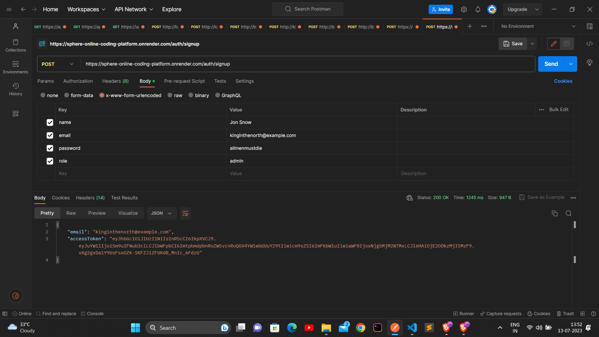
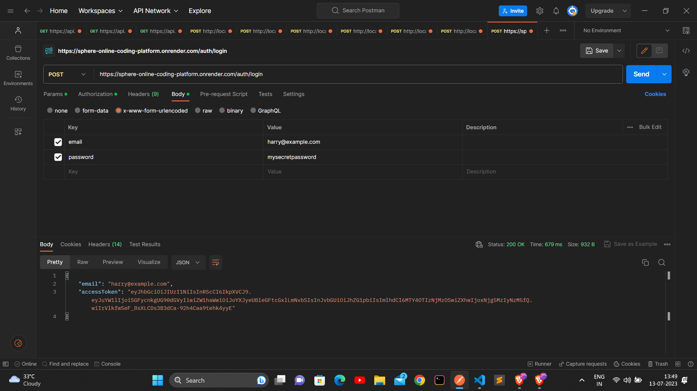
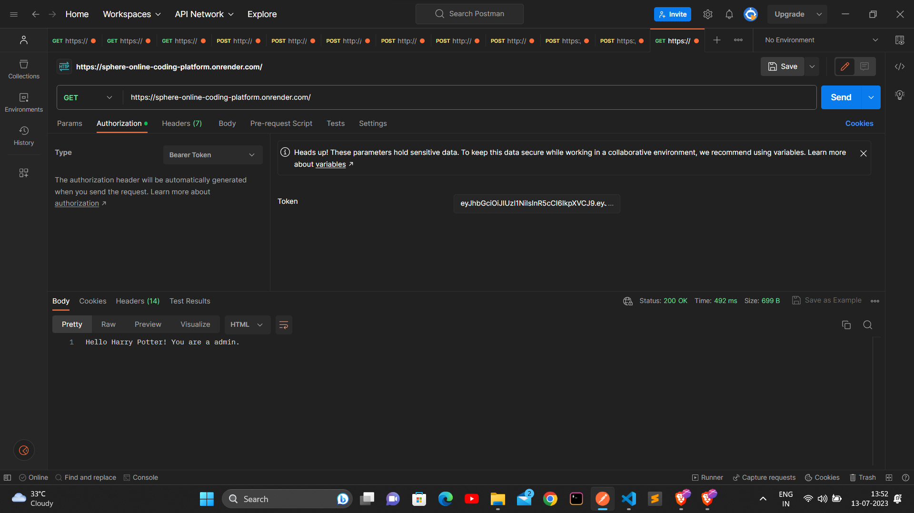
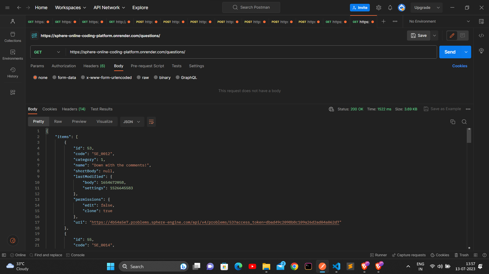
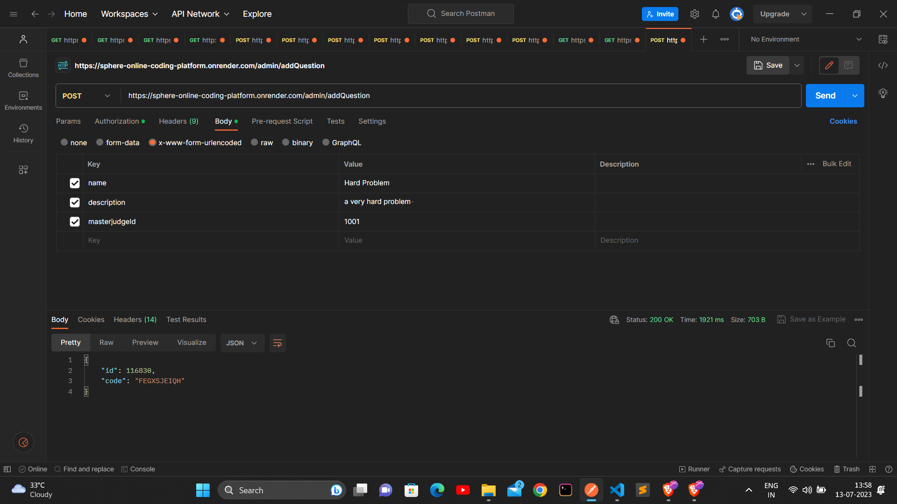
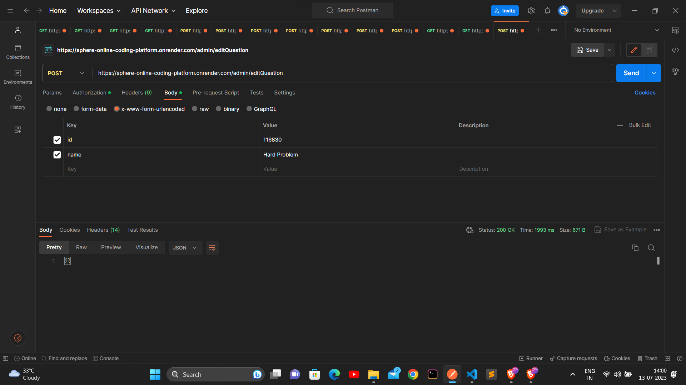
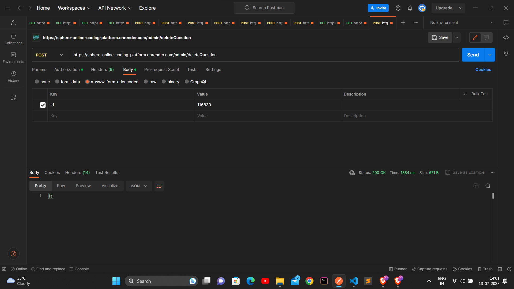
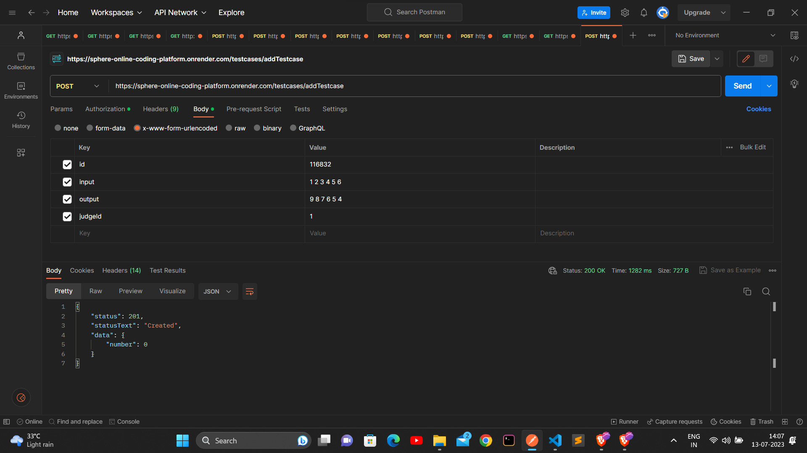

# Backend Web Developer - Assessment

To make a Coding platform where participants can solve questions for the problems provided, run the questions using the Sphere Engine, and the admin can add, edit or delete the questions.


## Running the code

In order to run the code, you are supposed to download the entire code and get your own environmental variables in the env file.

```sh
npm i
npm start 
```

variables in the .env file:

PORT
MONGO_URI
JWT_SECRET
SPHERE_PROBLEMS_TOKEN
SPHERE_PROBLEMS_URL
SPHERE_SUBMISSIONS_URL

## Testing the code

The API is hosted at [https://sphere-online-coding-platform.onrender.com/](https://sphere-online-coding-platform.onrender.com/)

## Features

- [Signup](#Signup)
- [Login](#Login)
- [List All Problems](#List-All-Problems)
- [Add Problems](#Add-Problems)
- [Edit Problems](#Edit-Problems)
- [Delete Problems](#Delete-Problems)
- [Add Test Cases](#Add-Test-Cases)
- [Home Page](#Home-Page)
- [Solution Verification](#Solution-Verification)


***Make sure you are using correct Bearer Token for all the requests.***


## Signup

route - [/signup](https://sphere-online-coding-platform.onrender.com/auth/signup)


Signup takes a POST request with four parameters name, email, password, role and gives you email, accessToken, refreshToken as response.

Request:

- POST

Parameters:

- name
- email
- password
- role




### Login

route - [/login](https://sphere-online-coding-platform.onrender.com/auth/login)

Login takes a POST request with two parameters email, password and gives you email, accessToken, refreshToken as response

Request:

- POST

Parameters:

- email
- password




### Home Page

route - [/](https://sphere-online-coding-platform.onrender.com/)

Greets the user with the name and role




### List All Questions

route - [/displayQuestions](https://sphere-online-coding-platform.onrender.com/questions) 

displayQuestions takes a GET request and gives you all questions in Sphere Engine as response including uploaded and auto generated

Request:

- GET

Parameters:

- NONE




### Add Questions

route - [/addQuestion](https://sphere-online-coding-platform.onrender.com/admin/addQuestion)

addQuestion takes a POST request with parameters name, description

Request:

- POST

Parameters:

- name
- description
- masterJudgeID




### Edit Questions

route - [/editQuestion](https://sphere-online-coding-platform.onrender.com/admin/editQuestion)

editQuestion takes a POST request with parameters new name, new description, id of the question

Request:

- POST

Parameters:

- id
- name
- description




### Delete Questions

route - [/deleteQuestion](https://sphere-online-coding-platform.onrender.com/admin/deleteQuestion)

deleteQuestion takes a POST request with id of the question

Request:

- POST

Parameters:

- id




### Add Test Cases

route - [/addTestCase](https://sphere-online-coding-platform.onrender.com/testcases/addTestCase)

addTestCase takes a POST request with id of the question, input, output, judgeId as the input

Request:

- POST

Parameters:

- id
- input
- output
- judgeId




### Solution Submission 

route - [/submission](https://sphere-online-coding-platform.onrender.com/solutions/submit)

submission takes a POST request with id of the question, source, compilerId as input

Request:

- POST

Parameters:

- problemId
- source
- compilerId

